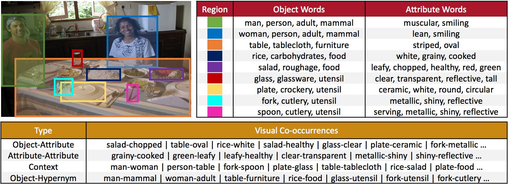
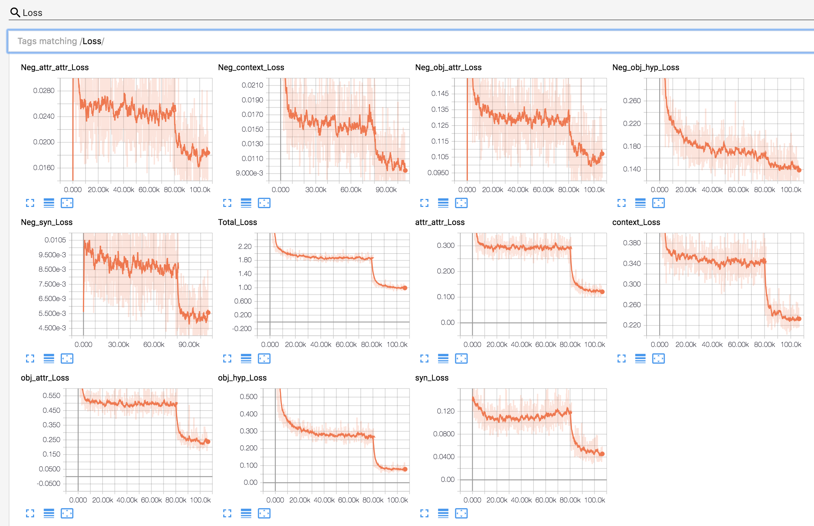

# ViCo: Word Embeddings from Visual Co-occurrences
By [Tanmay Gupta](http://tanmaygupta.info), [Alexander Schwing](http://alexander-schwing.de), and [Derek Hoiem](http://dhoiem.cs.illinois.edu)

<p align="center">
    
</p>

# Contents
- [Overview](#overview)
- [Just give me pretrained ViCo](#just-give-me-pretrained-vico)
- [Install Dependencies](#install-dependencies)
- [Setup](#setup)
- [Code Structure](#code-structure)
    - [Directories](#directories)
    - [A note on `run.py` files](#a-note-on-`run.py`-files)
- [Steps for Learning ViCo embeddings](#steps-for-learning-vico-embeddings)
    - [Quick Start](#quick-start)
    - [Step 1: Create co-occurrence matrices](#step-1-create-co-occurrence-matrices)
    - [Step 2: Train ViCo's multitask log-bilinear model](#step-2-train-vicos-multitask-log-bilinear-model)
        - [Start Training](#start-training)
        - [Finetune](#finetune)
        - [Monitor Losses](#monitor-losses)
        - [Time and Memory](#time-and-memory)
    - [Step 3: Extract embeddings from the saved model](#step-3-extract-embeddings-from-the-saved-model)
    - [Step 4: Concat with GloVe](#step-4-concat-with-glove)
        - [A note on memory vs speed trade-off for slicing/indexing](#a-note-on-memory-vs-speed-trade-off-for-slicingindexing)
    - [Step 5: Be Awesome :metal:](#step-5-use-vico-embeddings-in-your-awesome-project)
- [Evaluation](#evaluation)
    - [Unsupervised Clustering Analysis](#unsupervised-clustering-analysis)
    - [Supervised Partitioning Analysis](#supervised-partitioning-analysis)
    - [Zero-Shot Analysis](#zero-shot-analysis)
    - [Discriminative Attributes Task](#discriminative-attributes-task)

# Overview
Welcome to the official code base for ViCo - multi-sense word embeddings learned from different types of visual cooccurrences.

**Available on Arxiv**: [https://arxiv.org/abs/1908.08527](https://arxiv.org/abs/1908.08527)

**Project Page**: [http://tanmaygupta.info/vico/](http://tanmaygupta.info/vico/)

**BibTex**:
```
@inproceedings{gupta2019vico,
  title={ViCo: Word Embeddings from Visual Co-occurrences},
  author={Gupta, Tanmay and Schwing, Alexander and Hoiem, Derek},
  booktitle={ICCV},
  year={2019}
}
```

# Just give me pretrained ViCo
In a hurry? Download pretrained embeddings [here](https://drive.google.com/file/d/1WI2yQki4v2H_b-Ik1Xu7URKWxGML-Wv3/view?usp=sharing). Cooccurrences used to train these embeddings can be downloaded [here](https://drive.google.com/file/d/1RHsjy6BB8XTrYOB7QlKpSbnOvA7Tzh3G/view?usp=sharing).

Untar the downloaded directory and you will see the following directories:
- `glove_300_vico_linear_50:` GloVe + ViCo(linear,50)
- `glove_300_vico_linear_100:` GloVe + ViCo(linear,100)
- `glove_300_vico_linear_200:` GloVe + ViCo(linear,200)
- `glove_300_vico_select_200:` GloVe + ViCo(select,200)

Each of these directories consist of:
- `visual_word_vecs.h5py:` An h5py file containing the word embedding matrix of size 400000x(300+x) where x is {50,100,200}. First 300 dims. correspond to GloVe and remaining correspond to ViCo
- `visual_word_vecs_idx.json:` A json file mapping words to index in embedding matrix.
- `visual_words.json:` List of words for which ViCo exists. For other words not in visual vocabulary, the average ViCo embeddings are used in `visual_word_vecs.h5py`

To get embeddings for a particular word, say `dog`:
```python
import h5py
import json

word = 'dog'

glove_dim=300

f = h5py.File('visual_word_vecs.h5py','r')
word_to_idx = json.load(open('visual_word_vecs_idx.json','r'))
visual_words = json.load(open('visual_words.json','r'))

# To just slice the row in the matrix without loading the full matrix in RAM do the following:
embed_mat = f[embeddings]

# To load the entire matrix in memory (recommended if you are going to query words frequently) use the following instead:
# embed_mat = f[embeddings][()]

if word in word_to_idx:
    word_embed = embed_mat[word_to_idx[word]]
    word_embed_glove = word_embed[:glove_dim] # GloVe component
    word_embed_vico = word_embed[glove_dim:]  # ViCo component
else:
    print('Word not in vocabulary')

if word in visual_words:
    print('Word has ViCo component')
else:
    print('Word is not in the visual word vocabulary. word_embed_vico is set to average ViCo embedding computed across visual words')
```

# Install Dependencies

We provide a conda `environment.yml` file that lists all dependencies which can easily be installed using a single command
```
conda env create -f environment.yml
```

Once the installation is completed, launch the conda environment using 
```
conda activate vico_env
```

While the `environment.yml` file lists a lot of dependencies, they were all installed automatically as dependencies of the core packages listed in `install.sh`. So you could also install these using 
```
bash install.sh
```
However, this might try to install the latest packages which might have different version numbers than those in the `environment.yml` file which was used to test this repository.


# Setup 

We will assume we are currently in the root directory (which contains the `README.md`). All `bash` or `python` scripts described below will be executed from the root directory.

Before we begin, let us create a directory called `symlinks` in the root directory to store our data and experiments. 
```
mkdir symlinks
```

Because of hardware constraints, I keep my code and experiment outputs on the nfs, and datasets on local disks. So I create directories called `vico_data` and `vico_exp` as per need and create symlinks called `data` and `exp` pointing to these in the `symlinks` directory as follows
```
mkdir path_to_store_datasets/vico_data
ln -s path_to_store_datasets/vico_data symlinks/data

mkdir path_to_store_experiment_outputs/vico_exp
ln -s path_to_store_experiment_outputs/vico_exp symlinks/exp
```

To verify, run `ls -alh symlinks` and you should see something like
```
data -> path_to_store_datasets/vico_data
exp -> path_to_store_experiment_outputs/vico_exp
```

While you can choose any directory for storing datasets and experiments, the code base assumes symlinks to be called `data` and `exp`.

[Back to Contents](#contents)

# Code structure

## Directories
* `./data` contains scripts for downloading and preprocessing:
    * GloVe embeddings
        ```
        bash data/glove/download_glove.sh
        ```
    * ImageNet and VisualGenome datasets which are used for computing co-occurrences
        ```
        bash data/imagenet/download.sh
        bash data/visualgenome/download.sh
        ```
    * CIFAR-100 which is used for a zero-shot-like analysis
        ```
        bash data/cifar100/download.sh
        ```
    * Data for Discriminative Attributes Task (SemEval 2018 Task 10) which is a word-only downstream task. 
        ```
        bash data/semeval_2018_10/download.sh
        ```
* `./exp` contains scripts for computing co-occurrence statistics, learning ViCo embeddings, and evaluating embeddings. It also contains training and evaluation scripts for the Discriminative Attributes Task.
    
## A note on `run.py` files 
* Each directory in the `./exp` folder typically contains a `run.py` file which contains functions for launching sub-experiments or parts of the same experiment like training, embedding extraction, evaluation etc. 
* The name of these sub-experiment functions, which we refer to as *experiment runners*, begin with `exp_` like `exp_train`, `exp_extract_embeddings` etc. 
* An *experiment runner* specifies all parameters/constants relevant to launching an experiment. Typically a *runner* contains 3 types of constants -
    * `exp_const`: experiment constants like experiment name, optimizer etc
    * `data_const`: data constants like path to data files
    * `model_const`: model constants like network architecture hyperparameters 
* Executing a run file without any arguments, lists all available experiments
    ```
    $ python -m exp.genome_attributes.run
    ---------------------------------------------------------
    Select one of the following exp to run using flag --exp:
    ---------------------------------------------------------
    exp_create_gt_obj_attr_cooccur
    exp_create_gt_attr_attr_cooccur
    exp_create_gt_context_cooccur
    ```
* A specific experiment can be selected and executed using `--exp` argument
    ```
    $ python -m exp.genome_attributes.run --exp exp_create_gt_context_cooccur
    ```

[Back to Contents](#contents)

# Steps for Learning ViCo embeddings

## Quick Start
We provide a simple bash script `./exp/multi_sense_cooccur/scripts/helper.sh` that can be used to run all steps involved in learning ViCo. Simply modify the script to specify the `GPU` on which you want to run the experiments, and the steps you want to run using the `MODE` variable (multiple steps can be specified at once) and execute:
```
bash ./exp/multi_sense_cooccur/scripts/helper.sh
``` 

Each step is explained in detail below along with commands which are the same as the script but with explicit arguments for ViCo(linear,100) as a running example.

## Step 1: Create co-occurrence matrices

We compute the following types of co-occurrences from different sources:
* Object-Attribute (VisualGenome + WordNet)
* Attribute-Attribute (VisualGenome + WordNet)
* Context (VisualGenome + WordNet)
* Object-Hypernym (ImageNet + WordNet)
* Synonyms (WordNet)

If you have already downloaded the datasets, simply run:
```
bash exp/multi_sense_cooccur/create_cooccur.sh
```

This will create the following file which will be used to learn ViCo embeddings:
```
symlinks/exp/multi_sense_cooccur/cooccurrences/merged_cooccur.csv
```

For inspection, we provide a simple command line utility to load the csv into a pandas dataframe and interactively display all co-occurrences for a given word with other words sorted by co-occurrence types in ascending order (to avoid having to scroll to the top). To launch this utility run:
```
python -m exp.multi_sense_cooccur.explore_merged_cooccur
```
Follow the prompted instructions to interactively explore co-occurrences. To see the instructions again, simply call `usage()`.

## Step 2: Train ViCo's multitask log-bilinear model

We train ViCo initially with the Adam optimizer for faster convergence and fine-tune with Adagrad.

### Start Training
To start training with Adam, run:
```
CUDA_VISIBLE_DEVICES=0 python \
    -m exp.multi_sense_cooccur.run \
    --exp exp_train \
    --embed_dim 100 \
    --xform linear \
    --syn True
```
`embed_dim` is the ViCo embedding dimension and `xform` is the transformation function to be used in the multitask log-bilinear model. `xform` can alternatively be set to 'select'. It is easy to extend ViCo with other transforms as shown in `./exp/multi_sense_cooccur/models/logbilinear.py`. 

Here, we turned on the use of synonym co-occurrences during training using `--syn`.  However, we empirically found ViCo trained w/o synonym co-occurrences may perform slightly better. The version of embeddings used in the paper are trained w/o synonym co-occurrences. If that is the version you are after, go ahead and set `--syn False` here and in all commands below.

### Finetune
To finetune with Adagrad starting from a saved model, say at iteration number 80000, run:
```
CUDA_VISIBLE_DEVICES=0 python \
    -m exp.multi_sense_cooccur.run \
    --exp exp_train \
    --embed_dim 100 \
    --xform linear \
    --model_num 80000 \
    --syn True
```
Experiments data including hyperparameters/constants, tensorboard logs, and models are saved in `./symlinks/exp/multi_sense_cooccur/linear_100/`. Models, by default, are saved every 10000 iterations. Any model number other than `-1` (default) automatically selects Adagrad optimizer. 

### Monitor Losses
Losses can be monitored on tensorboard using
```
tensorboard --logdir=./symlinks/exp/multi_sense_cooccur/
```


Note the steep decrease in loss around 80000 iterations due to change in optimizer (learing rate is unchanged). `Neg_*` denotes the losses due to the **max** term while others correspond to the **log-bilinear** loss. `Total_Loss` denotes the sum of all losses.  

### Time and Memory
- Initial training + finetuning: ~10 hours on Titan Xp 
- GPU memory usage: ~1GB
- RAM usage: ~7GB 

## Step 3: Extract embeddings from the saved model

To extract embeddings from the embedding layer of the saved model, run:
```
python \
    -m exp.multi_sense_cooccur.run \
    --exp exp_extract_embeddings \
    --embed_dim 100 \
    --xform linear \
    --model_num 160000 \
    --syn True
```
This saves the following files in the `./symlinks/exp/multi_sense_cooccur/linear_100/` directory:
- `visual_embeddings.npy`: VxD matrix of ViCo embeddings where V is the vocabulary size, and D is the embedding dimension
- `visual_embeddings_xformed.npy`: VxD' matrix constructed by concatenating all transformed embeddings. Default configuration results in a concatenation of 50 dimensional transformed embeddings for each co-occurrence type in the following order:
    - Synonyms
    - Attribute-Attribute
    - Object-Attribute
    - Object-Hypernym
    - Context

    Note that for ViCo(select), `visual_embeddings.npy` and `visual_embeddings_xformed.npy` are the same while for ViCo(linear,100), D=100 and D'=250 (=50x5).
- `word_to_idx.json`: A dictionary mapping words to indices in the above npy files

## Step 4: Concat with GloVe

To concatenate GloVe with ViCo, run:
```
python \
    -m exp.multi_sense_cooccur.run \
    --exp exp_concat_with_glove \
    --embed_dim 100 \
    --xform linear \
    --glove_dim 300
```
This creates the following files in the `./symlinks/exp/multi_sense_cooccur/linear_100/concat_with_glove_300` directory:
- `visual_word_vecs.h5py`: An hdf5 file that contains Nx(300+D) dimensional embeddings where N is the GloVe vocabulary (assuming N > V, the visual co-occurrence vocabulary). If a word in GloVe's vocabulary does not exist in the visual vocabulary, the mean of ViCo embeddings is used instead.
- `visual_word_vecs_idx.json`: A dictionary mapping words to indices in the above h5py files.

The embedding for any word can be accessed as follows:
```python
import h5py
import json

# Load json file
word_to_idx = json.load(open('visual_word_vecs_idx.json', 'r'))

# Load h5py file
embeddings = h5py.File('visual_word_vecs.h5py','r')['embeddings']

word = 'green'
idx = word_to_idx[word]
word_embedding = embeddings[idx] # (400,) numpy.ndarray
glove_component = word_embedding[:300]
vico_component = word_embedding[300:]
```

### A note on memory vs speed trade-off for slicing/indexing

The advantage of h5py is that the variable `embeddings` refers to an h5py Dataset object which can be indexed to get individual rows without loading the entire embedding matrix (400000x400) into memory. However, every slice operation like `embeddings[idx]` would have to read from disk. This may not be an issue if slicing is infrequent but could be slow otherwise (for example if used in a dataloader to create mini-batches for a captioning-task).

Therefore, if RAM is not an issue, it is recommended to load the full matrix using:
```python
  embeddings = h5py.File('visual_word_vecs.h5py','r')['embeddings'][()]
  # Notice the '[()]' at the end
```
In this case, `embeddings` is the full embedding matrix loaded in RAM as a numpy array. Since the entire matrix is in RAM, slicing operations are fast. 

## Step 5: Use ViCo embeddings in your awesome project
Build on it, analyze it, improve it ...

OR

Run it through our evaluation protocol as described in the next section to better understand it.

[Back to Contents](#contents)

# Evaluation

We provide scripts for the following:
- Unsupervised clustering analysis
- Supervised partitioning analysis
- Zero-Shot-like (visual generalization) analysis
- Discriminative attributes task evaluation (SemEval 2018, Task 10)

**A note on reproducibility**: The current version of code uses slightly different Obj-Hyp cooccurrence counts. Specifically, earlier version required downloading imagenet images and cooccurrences were counted while iterating over the list of all downloaded images. However, in this scheme broken urls for which annotations are still available would be missed and also we would be downloading images unnecessarily even though all we need is annotations. Thus the current version just iterates over the urls and their annotations.

Another cause for variance is that different training runs may produce different embeddings because of SGD and these different embeddings might in turn lead to slightly different evaluation results. The results in the following section are from one example run using this code base to show the variance that can be expected in learning embeddings. The embeddings and cooccurrences used in the paper are available [here](https://drive.google.com/file/d/1WI2yQki4v2H_b-Ik1Xu7URKWxGML-Wv3/view?usp=sharing).

## Unsupervised Clustering Analysis

If you have the ViCo(linear,100) embeddings trained and concatenated with GloVe as described above, you can run the analysis by executing
```
python -m exp.multi_sense_cooccur.run --exp exp_unsupervised_clustering
```
This saves plots in `./symlinks/exp/multi_sense_cooccur/analysis/unsupervised_clustering` directory and prints average performance across cluster numbers in the terminal, which can directly be copied to a latex file

- Clustering performance on fine categories

    | Embedding | V-Measure | ARI |
    |:---------|:---------:|:---:|
    | GloVe | 0.50 | 0.15 |
    | ViCo(linear,100) | 0.58 | 0.20 |
    | GloVe+ViCo(linear,100) | 0.60 | 0.22 |
    | GloVe+ViCo(linear,100)[paper] | **0.61** | **0.23** |

- Clustering performance on coarse categories

    | Embedding | V-Measure | ARI |
    |:---------|:---------:|:---:|
    | GloVe | 0.52 | 0.38 |
    | ViCo(linear,100) | 0.56 | 0.34 |
    | GloVe+ViCo(linear,100) | **0.66** | **0.50** |
    | GloVe+ViCo(linear,100)[paper] | 0.65 | 0.48 |


### What if you want to compare other embeddings?
Usually we want to run such an analysis to compare various embeddings. Runner `exp_unsupervised_clustering` in `./exp/multi_sense_cooccur/run.py` file creates a dictionary called `data_const.embed_info` which contains all necessary information about embeddings which need to be evaluated. The information is provides through an instance of a python class which must have a `get_embedding` method and the following attributes/properties:
- `word_vecs_h5py`: Path to the h5py file
- `word_to_idx_json`: Path to the json file which maps words to indices in the h5py file

See the class `EmbedInfo` for example. Since all of my embeddings followed a consistent naming convention, I could use the same class to automatically construct these attributes. However, you could also use something simple like `SimpleEmbedInfo`.

The `get_embedding` method is used to extract parts of the embedding such as -- the GloVe component, the ViCo component, or keep both.


## Supervised Partitioning Analysis

The runner for the partitioning analysis is similar to the clustering case and can be executed using
```
python -m exp.multi_sense_cooccur.run --exp exp_supervised_partitioning
```
This saves plots in `./symlinks/exp/multi_sense_cooccur/analysis/supervised_partitioning` directory and prints average performance across various tree depths in the terminal, which can directly be copied to a latex file

- Partitioning performance on fine categories

    |Embedding | V-Measure | ARI | Accuracy |
    |:---------|:---------:|:---:|:-------:|
    |GloVe | 0.70 | 0.47 | 0.64 |
    |ViCo(linear,100) | 0.76 | 0.59 | 0.71 |
    |GloVe+ViCo(linear,100) | 0.74 | 0.52 | 0.67 |
    |GloVe+ViCo(linear,100)[paper] | **0.78** | **0.61** | **0.72** |


- Partitioning performance on coarse categories

    |Embedding | V-Measure | ARI | Accuracy |
    |:---------|:---------:|:---:|:-------:|
    |GloVe | 0.77 | 0.74 | 0.84 |
    |ViCo(linear,100) | 0.77 | 0.74 | 0.85 |
    |GloVe+ViCo(linear,100) | 0.79 | 0.77 | 0.86 |
    |GloVe+ViCo(linear,100)[paper] | **0.81** | **0.78** | **0.87** |

## Zero-Shot Analysis

Zero shot analysis is performed on ViCo concatenated with 100 dim. GloVe (instead of 300 dim.). This is because we would essentially be learning a function to regress classifiers from word vectors using less than 100 classes as training data. Learning the function from more than 100 dimensional embeddings is already ill-constrained and prone to overfitting.

So first, let us concatenate ViCo with GloVe 100 using the following:
```
python -m exp.multi_sense_cooccur.run --exp exp_concat_with_glove --embed_dim 100 --xform linear --glove_dim 100
```

To launch the zero-shot analysis (a.k.a visual generalization analysis) for ViCo(linear,100), run:
```
bash exp/cifar100/scripts/run.sh <num_held_out_classes> <gpu_id> <run_id>
```
where `num_held_out_classes` is one of {20,40,60,80}, `gpu_id` refers to the GPU on which to run the evaluation, and `run_id` is a number like {0,1,2,3,...} which is used to keep track of different runs. 

Results for different embeddings and runs can be aggregated using 
```
python -m exp.cifar100.run --exp exp_agg_results
```

[Back to Contents](#contents)

## Discriminative Attributes Task

To evaluate GloVe+ViCo(linear,100) on this task simply run:
```
bash exp/semeval_2018_10/scripts/svm_glove_vico.sh train_eval <run_id>
```

To evaluate GloVe only run the following:
```
bash exp/semeval_2018_10/scripts/svm_glove.sh train_eval <run_id>
```

[Back to Contents](#contents)