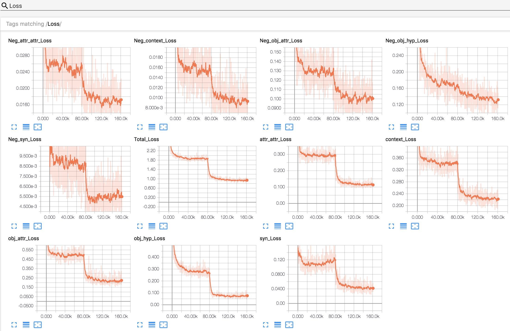

# ViCo: Word Embeddings from Visual Co-occurrences

# Contents
- [Setup](#setup)
- [Code Structure](#code-structure)
    - [Directories](#directories)
    - [A note on `run.py` files](#a-note-on-`run.py`-files)
- [Steps for Learning ViCo embeddings](#steps-for-learning-vico-embeddings)
    - [Step 1: Create co-occurrence matrices](#step-1:-create-co-occurrence-matrices)
    - [Step 2: Train ViCo's multitask log-bilinear model](#step-2:-train-vico's-multitask-log-bilinear-model)
        - [Start Training](#start-training)
        - [Finetune](#finetune)
        - [Monitor Losses](#monitor-losses)
    - [Step 3: Extract embeddings from the saved model](#step-3:-extract-embeddings-from-the-saved-model)
    - [Step 4: Concat with GloVe](#step-4:-concat-with-glove)
    - [Step 5: Be Awesome :metal:](#step-5:-use-vico-embeddings-in-your-awesome-project-:metal:)

# Setup
We will assume we are currently in the root directory (which contains the `README.md`). All `bash` or `python` scripts described below will be executed from the root directory.

Before we begin, let us create a directory called `symlinks` in the root directory to store our data and experiments. 
```
mkdir symlinks
```

Because of hardware constraints, I keep my code and experiment outputs on the nfs, and datasets on local disks. So I create directories called `vico_data` and `vico_exp` as per need and create symlinks called `data` and `exp` pointing to these in the `symlinks` directory as follows
```
mkdir path_to_store_datasets/vico_data
ln -s path_to_store_datasets/vico_data symlinks/data

mkdir path_to_store_experiment_outputs/vico_exp
ln -s path_to_store_experiment_outputs/vico_exp symlinks/exp
```

To verify, run `ls -alh symlinks` and you should see something like
```
data -> path_to_store_datasets/vico_data
exp -> path_to_store_experiment_outputs/vico_exp
```

While you can choose any directory for storing datasets and experiments, the code base assumes symlinks to be called `data` and `exp`.

# Code structure

## Directories
* `./data` contains scripts for downloading and preprocessing:
    * ImageNet and VisualGenome datasets which are used for computing co-occurrences
    * CIFAR-100 which is used for a zero-shot-like analysis
    * Data for Discriminative Attributes Task (SemEval 2018 Task 10) which is a word-only downstream task. 
* `./exp` contains scripts for computing co-occurrence statistics, learning ViCo embeddings, and evaluating embeddings. It also contains training and evaluation scripts for the Discriminative Attributes Task.
    
## A note on `run.py` files 
* Each directory in the `./exp` folder typically contains a `run.py` file which contains functions for launching sub-experiments or parts of the same experiment like training, embedding extraction, evaluation etc. 
* The name of these sub-experiment functions, which we refer to as *experiment runners*, begin with `exp_` like `exp_train`, `exp_extract_embeddings` etc. 
* An *experiment runner* specifies all parameters/constants relevant to launching an experiment. Typically a *runner* contains 3 types of constants -
    * `exp_const`: experiment constants like experiment name, optimizer etc
    * `data_const`: data constants like path to data files
    * `model_const`: model constants like network architecture hyperparameters 
* Executing a run file without any arguments, lists all available experiments
    ```
    $ python -m exp.genome_attributes.run
    ---------------------------------------------------------
    Select one of the following exp to run using flag --exp:
    ---------------------------------------------------------
    exp_create_gt_obj_attr_cooccur
    exp_create_gt_attr_attr_cooccur
    exp_create_gt_context_cooccur
    ```
* A specific experiment can be selected and executed using `--exp` argument
    ```
    $ python -m exp.genome_attributes.run --exp exp_create_gt_context_cooccur
    ```

# Steps for Learning ViCo embeddings

## Step 1: Create co-occurrence matrices

We compute the following types of co-occurrences from different sources:
* Object-Attribute (VisualGenome)
* Attribute-Attribute (VisualGenome)
* Context (VisualGenome)
* Object-Hypernym (ImageNet)
* Synonyms (WordNet)

If you have already downloaded the datasets, simply run:
```
bash exp/multi_sense_cooccur/create_cooccur.sh
```

This will create the following file which will be used to learn ViCo embeddings:
```
symlinks/exp/multi_sense_cooccur/imagenet_genome_gt/merged_cooccur.csv
```

For inspection, we provide a simple command line utility to load the csv into a pandas dataframe and interactively display all co-occurrences for a given word with other words sorted by co-occurrence types in ascending order (to avoid having to scroll to the top). To launch this utility run:
```
python -m exp.multi_sense_cooccur.explore_merged_cooccur
```
Follow the prompted instructions to interactively explore co-occurrences. To see the instructions again, simply call `usage()`.

## Step 2: Train ViCo's multitask log-bilinear model

We train ViCo initially with the Adam optimizer for faster convergence and fine-tune with Adagrad.

### Start Training
To start training with Adam, run:
```
CUDA_VISIBLE_DEVICES=0 python \
    -m exp.multi_sense_cooccur.run \
    --exp exp_train \
    --embed_dim 100 \
    --xform linear
```
`embed_dim` is the ViCo embedding dimension and `xform` is the transformation function to be used in the multitask log-bilinear model. `xform` can alternatively be set to 'select'. It is easy to extend ViCo with other transforms as shown in `./exp/multi_sense_cooccur/models/logbilinear.py`.

### Finetune
To finetune with Adagrad starting from a saved model, say at iteration number 80000, run:
```
CUDA_VISIBLE_DEVICES=0 python \
    -m exp.multi_sense_cooccur.run \
    --exp exp_train \
    --embed_dim 100 \
    --xform linear \
    --model_num 80000
```
Experiments data including hyperparameters/constants, tensorboard logs, and models are saved in `./symlinks/exp/multi_sense_cooccur/linear_100/`. Models, by default, are saved every 10000 iterations. Any model number other than `-1` (default) automatically selects Adagrad optimizer. 

### Monitor Losses
Losses can be monitored on tensorboard using
```
tensorboard --logdir=./symlinks/exp/multi_sense_cooccur/
```


Note the steep decrease in loss around 80000 iterations due to change in optimizer (learing rate is unchanged). `Neg_*` denotes the losses due to the **max** term while others correspond to the **log-bilinear** loss. `Total_Loss` denotes the sum of all losses.  

## Step 3: Extract embeddings from the saved model

## Step 4: Concat with GloVe

## Step 5: Use ViCo embeddings in your awesome project :metal:
Build on it, analyze it, improve it ...

OR

Run it through our evaluation protocol as described in the next section to better understand it.

# Evaluation

We provide scripts for the following:
1. Unsupervised clustering analysis
2. Supervised partitioning analysis
3. Zero-Shot-like (visual generalization) analysis
4. Discriminative attributes task evaluation

